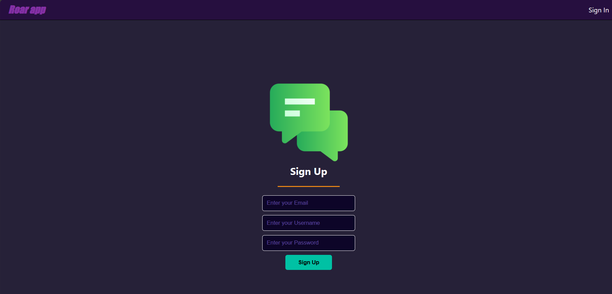

# Roar App

Roar App is a social media platform where users can share their thoughts, connect with friends, and engage with the community through messaging and posts.

# Features

* User Authentication: Users can sign up and log in to their accounts securely.

* Profile Customization: Users can customize their profiles by adding a bio and avatar.
  
* Messaging: Users can send messages (roars) to the community.
  
* Post Creation: Users can create posts with text and optional images.
  
* Like and Dislike: Users can like or dislike posts shared by others.
  
* Real-time Updates: Changes to user profiles and new posts are reflected in real-time.
  
* Protected Routes: Certain routes are protected, allowing only authenticated users to access them.

# Technologies Used

*React: Frontend framework for building the user interface.
*Firebase: Backend services for authentication, database (Firestore), and storage.
*React Router DOM: Library for handling navigation within the application.

# Screenshots

* Signin Page

  

* Signup Page

   

* Home Page

  

* Profile Page

   

* Messaging Page

   

* Edit Profile Page

  

# Getting Started
To get started with Roar App, follow these steps:

1- Clone the repository: git clone https://github.com/your-username/roar-app.git
2- Install dependencies: npm install
3- Set up Firebase: Create a Firebase project and configure authentication, Firestore, and Storage.
4- Add Firebase configuration: Create a firebase.js file in the src directory and add your Firebase configuration.
5- Run the application: npm start
6- Access the application in your browser at http://localhost:3000

# Created by

* Naif Askul

* Nawaf Alghamdi
